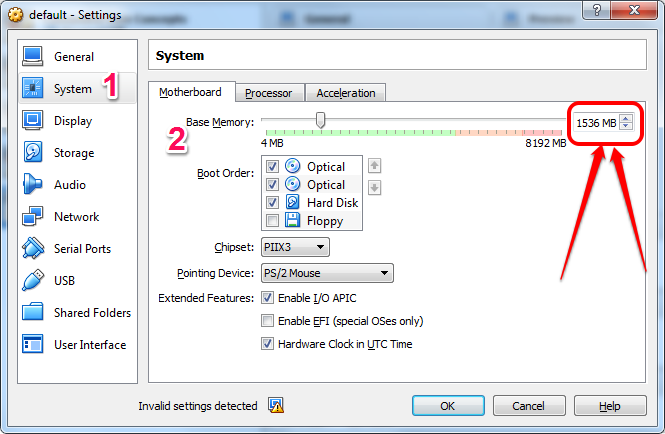
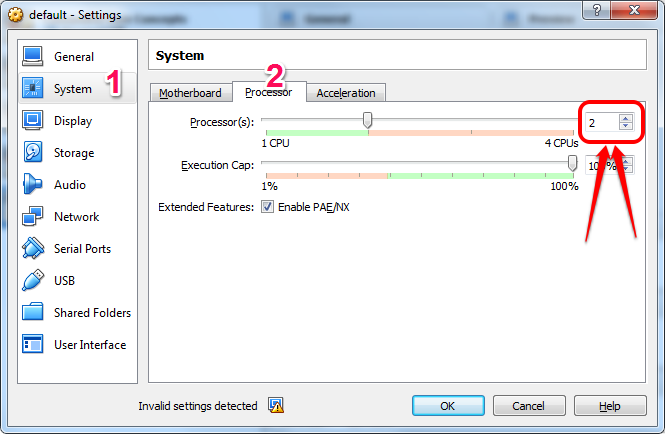

# Visualization of Twitter Sentiment using Spark MLlib 

## Introduction
Project to analyze and visualize Sentiment of tweets in real-time on a world map using Spark MLlib.

Please check the accompanying [Docker image](https://hub.docker.com/r/p7hb/p7hb-docker-mllib-twitter-sentiment) for the environment related info and the [blogpost](http://P7h.org) for detailed info on this project.

## Demo
### TBD

## Features
* TBD
* Application retrieves tweets using Twitter Streaming API (using [Twitter4J](http://twitter4j.org)). 
* It analyses sentiments of all the tweets using Spark MLlib and Stanford CoreNLP.
* For visualization, [Datamaps](https://datamaps.github.io/) built on D3.js is used to display the tweet location on the world map with a pop up for more details on hover.
* Visualization is responsive and adjusts based on the resolution / resizing of the window.
* This codebase has been updated with decent comments, wherever required.

## Dependencies

Following is the list of languages, libraries and components used in this project.

0. OpenJDK 64-Bit v1.8.0_102 » Java for compiling and execution
1. Scala v2.10.6 » basic infrastructure and Spark jobs
2. SBT v0.13.12 » build file for scala code
3. Apache Spark v1.6.2
	* Spark Streaming » connecting to Twitter and streaming the tweets
	* Spark MLlib » creating a ML model and predicting the sentiment of tweets based on the text
	* Spark SQL » saving tweets [both raw and classified]
4. Stanford CoreNLP v3.6.0 » alternative mechanism to find sentiment of tweets based on the text
5. Redis » saving classified tweet info for the front-end to render the chart
6. D3.js / Datamaps » charting
7. Python » running the flask app for rendering the front-end
8. Flask » rendering the template for front-end

Also, please check [`build.sbt`](build.sbt) for more information on the various other dependencies of the project. 

## Prerequisites for successful execution

* A decent machine in which you can allocate at least the following to the Docker-machine [actually the more, the merrier]:
	* 1.5 GB RAM
	* 2 CPUs
	* 6 GB free disk space
* We will need unfettered internet access for executing this project.
* Twitter App OAuth Credentials are mandatory. This is for retrieving tweets from Twitter in real-time.
* We will download ~1.5 GB of data with this image and SBT dependencies, etc and also tweets.

### Resources for the Docker machine
* Stop docker-machine.

	`docker-machine stop default`

* Launch Virtual Box and click on settings of `default` instance, which should be in `Powered Off` state.
* Fix the settings as highlighted in the screenshots below. Please note this is minimum required config; you might want to allocate more.

#### Increase RAM

#### Increase # of CPUs

* Relaunch docker after modifying the settings.
* Now `cat /proc/cpuinfo` should report 2 CPUs and `cat /proc/meminfo` should report 1.5 GB RAM.
	* Or the resources you allocated earlier.

## Env Setup
Please use the accompanying [Docker image](https://github.com/P7h/p7hb-docker-mllib-twitter-sentiment) created for this project.

## Execution
### Pull the image from Docker Hub
With this approach, we are basically pulling the image hosted on Docker Hub directly instead of building it ourselves.

    docker pull p7hb/p7hb-docker-mllib-twitter-sentiment:1.6.2

### Run the Docker image
This step will launch and run the image and after it completes the initial setup, you will land into a bash shell waiting for your input.

    docker run -ti -p 4040:4040 -p 8080:8080 -p 8081:8081 -p 9999:9999 -h spark --name=spark p7hb/p7hb-docker-mllib-twitter-sentiment:1.6.2

Please note the following:

 * `root` is the user we logged into.
 * `spark` is host name of this container. This is very important as Spark Slaves are started using this host name as the master.
 * `spark` is the container name.
 * Exposes ports 4040, 8080, 8081 for Spark Web UI console and 9999 for Twitter Sentiment Visualization.

## Twitter App OAuth Credentials
The only manual intervention required in this project is setting up a Twitter App and updating its Credentials to connect to Twitter Streaming API.

* Please check the [`application.conf`](src/main/resources/application.conf#L7-10) and add your own values and complete the integration of Twitter API to your application by looking at your values from [Twitter Developer Page](https://dev.twitter.com/apps).
	* If you did not create a Twitter App before, then please create a new Twitter App on [Twitter Developer Page](https://dev.twitter.com/apps), where you will get all the required values of `application.conf` afresh and then populate them here without any mistake. 

## Execution
Please execute [`exec_spark_jobs.sh`](exec_spark_jobs) on the console.

This script first starts Spark Master and Spark Slave and then launches the Spark jobs one after the other.

This might take sometime as SBT will initiate a download and setup of all the required packages from Maven Central Repo and Typesafe repo as required.

### Visualization app
After a few minutes of launching the Spark jobs, point your browser on the host machine to [`http://192.168.99.100:9999/`](http://192.168.99.100:9999/) to view the Twitter Sentiment visualized on a world map.

Hover over a bubble to see additional info about that data point.

## TODO
* Visualization could be completely scrapped for something better and UX needs a lot of uplifting.
* Use Spark wrapper for [Stanford CoreNLP](https://spark-packages.org/package/databricks/spark-corenlp) and reduce the boilerplate code further.
* Update the project to Spark v2.0.
	* Push out RDD; hello DataFrames / Datasets.
* GIF animation of the visualization.
* TBD

> ###NOTE:
Please do not forget to modify the Twitter App OAuth credentials in the file [`application.conf`](src/main/resources/application.conf#L7-10). 
Please check [Twitter Developer page](https://dev.twitter.com/apps) for more info. 

## License
Copyright &copy; 2016 Prashanth Babu. 
Licensed under the [Apache License, Version 2.0](LICENSE).
